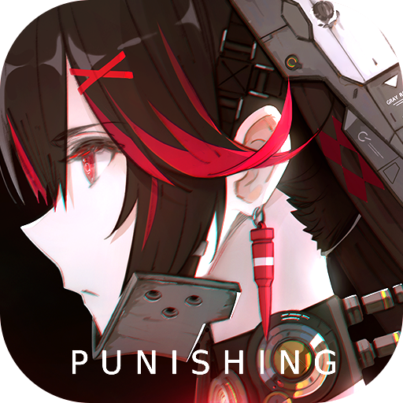

<!-- markdownlint-disable MD033 MD041 -->
<p align="center">
  
</p>

<div align="center">

# MAA_Punish

基于全新架构的 战双帕弥什 小助手。图像技术 + 模拟控制，解放双手！  
由 [MaaFramework](https://github.com/MaaXYZ/MaaFramework) 强力驱动！

</div>

<p align="center">
  
  
  
  
  
</p>

## 主要功能

- 启动/关闭游戏
- 指挥局抽签
- 宿舍委托
- 宿舍任务
- 指挥局签到
- 拟真围剿
- 刷A级碎片
- 纷争战区自动首通
- 诺曼矿区自动首通
- 幻痛囚笼自动首通
- 维系者行动
- 领取邮件
- 商店自动购买逆元碎片
- 领取体力
- 自动刷拟战场域
- 领取凭证和任务奖励
- 自动肉鸽-厄愿潮声
- 自动肉鸽-矩阵循生
- 自动肉鸽-寒境曙光
- 自动肉鸽-神寂启示录

## 注意事项

- 打开无法运行首先尝试安装运行库 <https://learn.microsoft.com/zh-cn/cpp/windows/latest-supported-vc-redist?view=msvc-170>
- 如有其他问题可以提交issue或者加群反馈 **965061066**，反馈问题请附上日志文件 `debug/maa.log`，谢谢！

## 使用说明

下载地址：[https://github.com/overflow65537/MAA_Punish/releases](https://github.com/overflow65537/MAA_Punish/releases)

### Windows

- 对于绝大部分用户，请下载 `MPA-win-x86_64-vXXX.zip`
- 若确定自己的电脑是 arm 架构，请下载 `MPA-win-aarch64-vXXX.zip`
- 解压后运行 `MaaPiCli.exe`（命令行）或者`MFW.exe`（图形化界面） 即可

### macOS

- 若您的 Mac 采用 Intel 处理器，请下载 `MPA-macos-x86_64-vXXX.tar.gz`
- 若您的 Mac 采用 M1、M2 等 ARM 处理器，请下载 `MPA-macos-aarch64-vXXX.tar.gz`
- 使用方法如下：
  1. 打开终端，解压下载的压缩包，您有以下三种解压方式可供选择：

      **选项 1：解压到系统目录（需管理员权限）**
      此方式将把程序解压到系统目录，需要输入管理员密码获取权限。

      ```zsh
      sudo mkdir -p /usr/local/bin/MPA
      sudo tar -xzf <下载的MPA压缩包路径> -C /usr/local/bin/MPA
      ```

      **选项 2：解压到用户目录（推荐）**
      该方式无需管理员权限，操作简便且便于管理个人文件。

      ```zsh
      mkdir -p ~/MPA
      tar -xzf <下载的MPA压缩包路径> -C ~/MPA
      ```

      **选项 3：直接解压到下载目录（不推荐）**
      这种方式操作快捷，但可能会导致 `Downloads` 文件夹文件杂乱。您只需双击下载的 MPA 压缩包，即可在同级目录自动解压。

  2. 进入解压目录并运行程序：
      - 根据上一步选择的解压方式操作：
          - 若选择选项 1 ，在终端中执行以下命令打开程序目录：

          ```zsh
          open /usr/local/bin/MPA
          ```

          - 若选择选项 2，在终端中执行以下命令打开程序目录：

          ```zsh
          open ~/MPA
          ```

          - 若选择选项 3，直接双击解压后的文件夹进入。
      - 找到 `MFW` 程序并双击运行。

  ⚠️Gatekeeper 安全提示处理：
  在 macOS 10.15 (Catalina) 及更高版本中，Gatekeeper 可能会阻止运行未签名的应用程序。若遇到“无法打开，因为无法验证开发者”,或者“已损坏”等错误，请使用以下命令移除隔离属性：

  ```zsh
  sudo xattr -rd com.apple.quarantine /usr/local/bin/MPA/*
  # 若选择选项 2，解压到用户目录，使用以下命令：xattr -rd com.apple.quarantine ~/MPA/*
  # 若选择选项 3，直接解压到下载目录，使用以下命令：xattr -rd com.apple.quarantine <下载目录>/MPA/*


### Linux

~~用 Linux 的大佬应该不需要我教~~

## 开发相关

  MPA目前支持[深红囚影](assets/custom/action/exclusives/CrimsonWeave.py),[深谣](assets/custom/action/exclusives/LostLullaby.py),[终焉](assets/custom/action/exclusives/Oblivion.py),[誓焰](assets/custom/action/exclusives/Pyroath.py),[启明](assets/custom/action/exclusives/Shukra.py)以及[深痕](assets/custom/action/exclusives/Stigmata.py)的自动战斗逻辑,其余部分人物由于开发者精力有限,无法同时添加,如果希望自行添加，具体参考[如何编写战斗逻辑](docs/自动战斗框架开发指南.md)，开发途中有问题可以进群反馈 **965061066**

### 开发文档

- [MaaFramework 快速开始](https://github.com/MaaAssistantArknights/MaaFramework/blob/main/docs/zh_cn/1.1-%E5%BF%AB%E9%80%9F%E5%BC%80%E5%A7%8B.md)
- [如何编写战斗逻辑](docs/自动战斗框架开发指南.md)

### How to build

**如果你要编译源码才看这节，否则直接 [下载](https://github.com/overflow65537/MAA_Punish/releases) 即可**

0. 完整克隆本项目及子项目

    ```bash
    git clone --recursive https://github.com/overflow65537/MAA_Punish.git
    ```

1. 下载 MaaFramework 的 [Release 包](https://github.com/MaaXYZ/MaaFramework/releases)，解压到 `deps` 文件夹中
2. 安装

    ```python
    python ./install.py
    ```

生成的二进制及相关资源文件在 `install` 目录下

## 鸣谢

### 开源库

- [MaaFramework](https://github.com/MaaXYZ/MaaFramework)
  
  基于图像识别的自动化黑盒测试框架 | An automation black-box testing framework based on image recognition

- [MFW-PyQt6](https://github.com/overflow65537/MFW-PyQt6)
  基于 PyQt6 的 MaaFramework 前端 | A frontend based on PyQt6 for MaaFramework

### 开发者

感谢以下开发者对 MAA_Punish 作出的贡献：

<a href="https://github.com/overflow65537/MAA_Punish/graphs/contributors">
  
</a>
